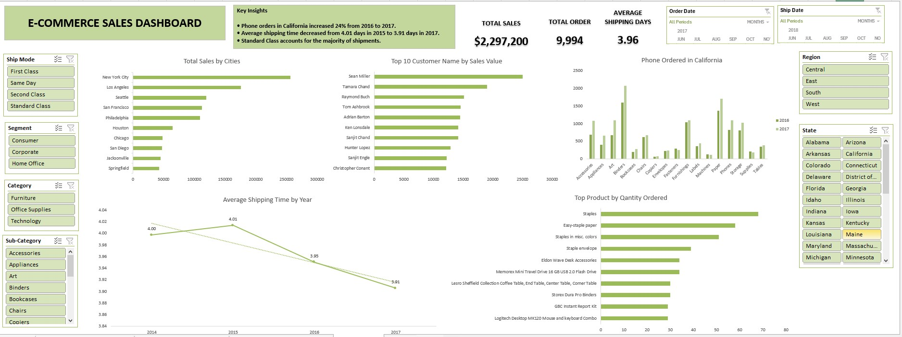
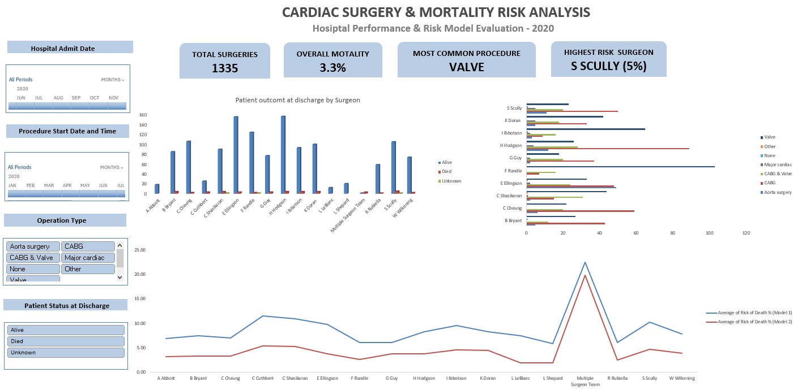
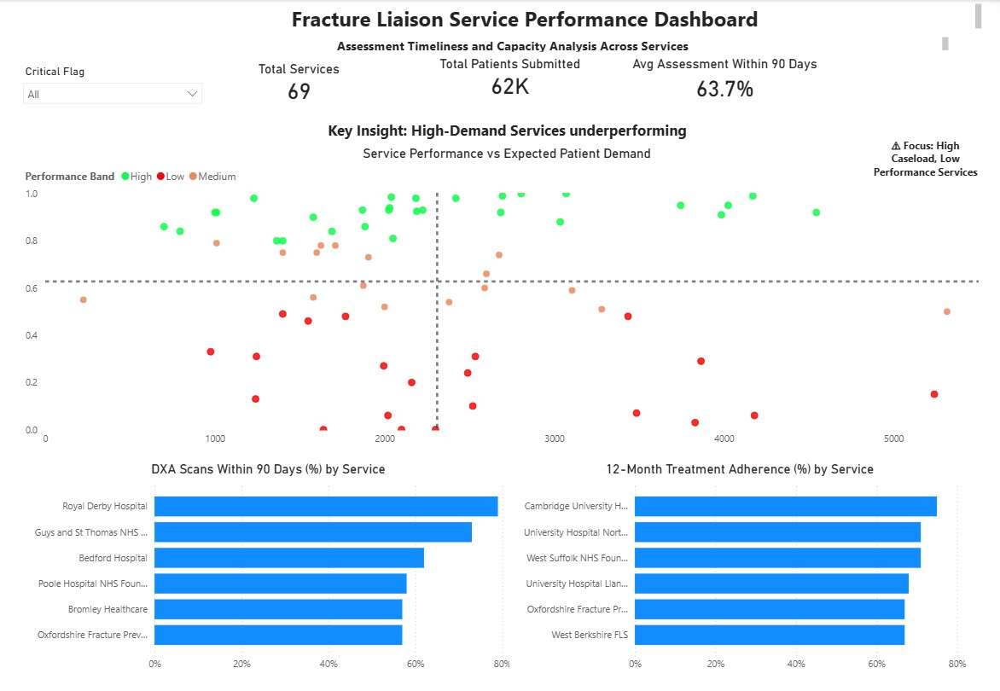

# Michael Oluwaseun
## Data Analyst | SQL • Excel • Power BI | Reporting • Insights • Dashboards
### Helping organisations make better decisions by transforming complex data into clear insights through analytics and data visualisation.

Data Analyst with over 2 years of experience in data analytics, specialising in Structured Query Language for data extraction, transformation, and data manipulation, Microsoft Excel for advanced reporting and modelling, and Power BI for building interactive dashboards. I transform raw data into clear insights that support better decisions and improved performance.

---

### 📊 Portfolio Projects

### SQL Business Contact Data Cleaning Pipeline

This project demonstrates how SQL can be used to clean, standardise, and validate scraped business contact data before analysis.

The workflow imports raw scraped data into a staging table, cleans and standardises fields using SQL transformations, and performs validation checks to ensure data quality before analysis.

**Tools Used**
- SQL Server
- T-SQL
- Data cleaning techniques
- Data validation queries

Project Link:  [View SQL Project on GitHub](https://github.com/MichaelOluwaseun246/pub-contact-data-cleaning-sql/blob/main/README.md)

**Key Skills Demonstrated**
- Data cleaning and transformation
- Handling missing values
- Email validation logic
- Duplicate detection
- SQL data quality checks

---

### E-Commerce Sales Performance Dashboard

This project analyses an e-commerce sales dataset to evaluate business performance, customer behaviour, and operational efficiency.

Using Microsoft Excel, I cleaned and explored sales transaction data and built an interactive dashboard that enables users to analyse sales trends, customer value, and product performance across regions and time periods.

**Tools Used**
- Microsoft Excel
- PivotTables & PivotCharts
- Slicers and Timeline Filters
- Calculated Metrics
- Interactive Dashboard Design

**Key Insights**
- Total sales exceeded $2.29M across nearly 10,000 orders.
- Phone orders in California increased by 24% between 2016 and 2017.
- Average shipping time improved from 4.01 days in 2015 to 3.91 days in 2017.
- Standard shipping accounted for the majority of fulfilled orders.

🔗 **Project Link** [Excel Analysis File](https://github.com/MichaelOluwaseun246/MichaelOluwaseun246.github.io/blob/main/E-commerce%20project.xlsx)

**Interactive Dashboard Overview**

---

### Cardiac Surgery Performance & Mortality Risk Analysis (2020)

This project analyses 1,335 cardiac surgery procedures to evaluate surgical activity, patient outcomes, and mortality risk across surgeons and procedure types.

Using Excel, the data was cleaned, validated, and analysed, with an interactive dashboard developed to explore key performance indicators.

Tools: Microsoft Excel (PivotTables, PivotCharts, Data Cleaning, Timelines, Slicers, Calculated metrics)

🔗 Project Link: [Excel Analysis File](https://github.com/MichaelOluwaseun246/MichaelOluwaseun246.github.io/blob/main/Cardiac%20Surgery%20%26%20Mortality%20Risk%20Analysis.xlsx)

## 🔍 Key Business Questions
- How does mortality rate vary across surgeons?
- Which procedures account for the highest surgical volume?
- How do predicted mortality risks compare with actual outcomes?
- Are there variations in surgical workload across surgeons?

## 📊 Key Insights
- Overall mortality rate was ~3.3%, indicating positive patient outcomes
- Mortality varied across surgeons, with S. Scully highest (~5%)
- CABG and Valve procedures dominated surgical activity
- Model 1 predicted consistently higher risk than Model 2
- Small sample sizes influenced outlier risk values
- Majority of patients were discharged alive, indicating strong data quality

**Interactive Dashboard Overview**

---

# 📊 Fracture Liaison Service Performance Dashboard

This project presents a comprehensive analysis of Fracture Liaison Service (FLS) performance using Power BI, focusing on patient management efficiency, assessment timelines, and long-term treatment adherence.

## 🔍 Key Business Questions
- Are hospitals capturing all fracture patients they are expected to manage?
- How quickly are patients assessed after referral?
- Are DXA scans conducted within recommended timelines?
- Are patients adhering to treatment after 12 months?

## 📈 Key Insights
- High-demand services tend to underperform in timely patient assessment.
- There is a clear variation in performance across services.
- Some hospitals achieve high adherence rates despite moderate caseloads.
- Opportunities exist to improve early assessment and long-term patient monitoring.

## 🛠️ Tools & Skills Used
Power BI (Data Visualization & Dashboarding)
SQL (Data extraction and transformation)
Excel (Data cleaning and preparation)
Data Analysis (EDA, KPI tracking, performance segmentation)

## Interactive Dashboard Overview

## 📌 Project Highlights
Built an interactive dashboard to monitor healthcare service performance
Used scatter plot quadrant analysis to identify underperforming high-demand services
Applied KPI-driven storytelling to support healthcare decision-making

## 📬 Contact

- LinkedIn: www.linkedin.com/in/oluwaseunmichael  
- Email: oluwaseunmichael62@gmail.com  
- GitHub: https://github.com/MichaelOluwaseun246  
